# ETW Threat Intelligence Overview

A brief examination of ETW's protections against fraudulent API calls

## Introduction

Following a discussion of current techniques for identifying malicious API calls and kernel callbacks (such as [`PsCreateThreadNotifyRoutine`](https://docs.microsoft.com/en-us/windows-hardware/drivers/ddi/ntddk/nf-ntddk-pssetcreatethreadnotifyroutine) and [`ObRegisterCallbacks`](https://docs.microsoft.com/en-us/windows-hardware/drivers/ddi/wdm/nf-wdm-obregistercallbacks)), Windows Defender's ETW capabilities was recently brought to my notice. In a recent blog post titled "[Evading WinDefender ATP credential-theft: kernel version](https://b4rtik.github.io/posts/evading-windefender-atp-credential-theft-kernel-version/)" - [B4rtik](https://twitter.com/b4rtik), discusses how to attack the ETW within the kernel by inlining a patch called "NT!EtwTiLogReadWriteVm" that would prevent NtReadVirtualMemory from detecting LSASS reads.

### The software versions at the time of writing are as follows
```
Microsoft Windows 11 Enterprise 23H2 (build: 22631.2050)
ntoskrnl.exe Version 10.0.22621.2050
```
## Investigating Threat Intelligence ETW Capabilities

I researched `MiReadVirtualMemory`, which is basically [`NtReadVirtualMemory`](https://undocumented.ntinternals.net/index.html?page=UserMode%2FUndocumented%20Functions%2FMemory%20Management%2FVirtual%20Memory%2FNtReadVirtualMemory.html) wrapped around. It ultimately calls `EtwTiLogReadWriteVm` as described:
### 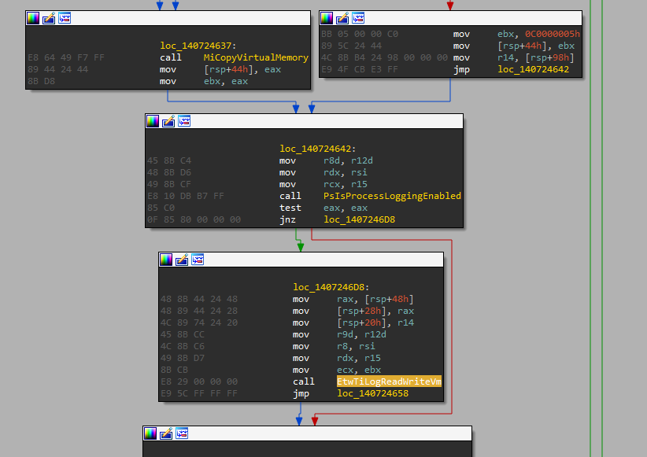
<sub>`EtwTiLogReadWriteVm` called in `MiReadVirtualMemory`</sub>


According to the name, [`NtWriteVirtualMemory`](https://undocumented.ntinternals.net/index.html?page=UserMode%2FUndocumented%20Functions%2FMemory%20Management%2FVirtual%20Memory%2FNtWriteVirtualMemory.html) also likely calls this. If we examine the code, we find a function call to [`EtwProviderEnabled`](https://docs.microsoft.com/en-us/windows-hardware/drivers/ddi/wdm/nf-wdm-etwproviderenabled) that accepts the input `EtwThreatIntProvRegHandle`:
### 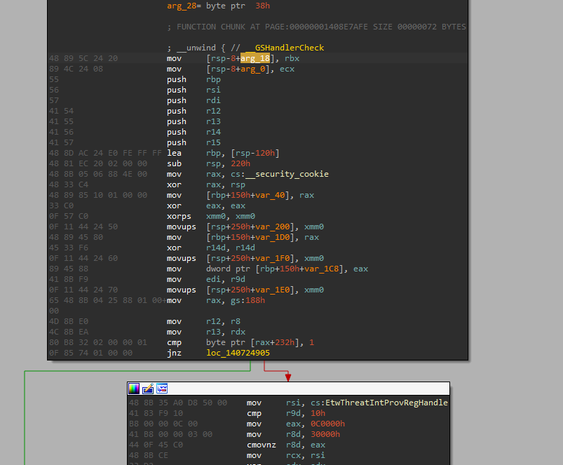
<sub>[`EtwProviderEnabled`](https://docs.microsoft.com/en-us/windows-hardware/drivers/ddi/wdm/nf-wdm-etwproviderenabled) called with `EtwThreadIntProvRegHandle`</sub>

#### I therefore conclude that this handle is connected to "threat intelligence" occurrences. Cross-referencing this handle reveals that it is employed in several other places, including:
```
EtwTiLogInsertQueueUserApc
EtwTiLogAllocExecVm
EtwTiLogProtectExecVm
EtwTiLogReadWriteVm
EtwTiLogDeviceObjectLoadUnload
EtwTiLogSetContextThread
EtwTiLogMapExecView
EtwTiLogDriverObjectLoad
EtwTiLogDriverObjectUnLoad
EtwTiLogSuspendResumeProcess
EtwTiLogSuspendResumeThread
```

### 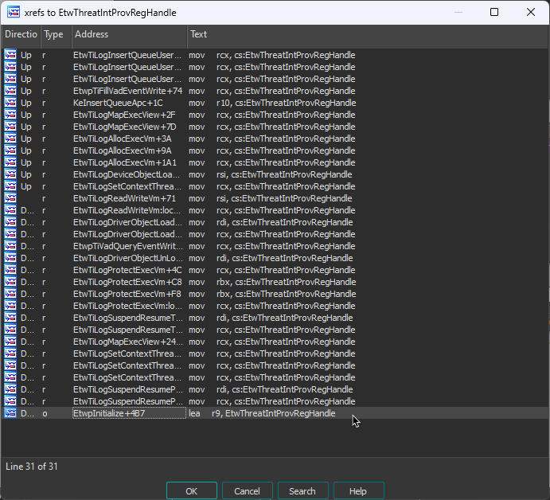
<sub>Cross-references to `EtwThreatIntProvRegHandle`</sub>

The threat intelligence provider appears to log event data on extremely popular harmful APIs, such as [`VirtualAlloc`](https://docs.microsoft.com/en-us/windows/win32/api/memoryapi/nf-memoryapi-virtualalloc), [`WriteProcessMemory`](https://docs.microsoft.com/en-us/windows/win32/api/memoryapi/nf-memoryapi-writeprocessmemory), [`SetThreadContext`](https://docs.microsoft.com/en-us/windows/win32/api/processthreadsapi/nf-processthreadsapi-setthreadcontext), and [`ResumeThread`](https://docs.microsoft.com/en-us/windows/win32/api/processthreadsapi/nf-processthreadsapi-resumethread), which are the mainstays of process hollowing, as is pretty clear from these function names.

The handle is initialized in `EtwpInitialize`, which is also referenced:
### 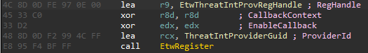
<sub>`EtwThreatIntProvRegHandle` initialisation</sub>

`EtwThreatIntProviderGuid` is defined as such:
### 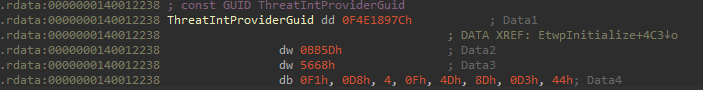
<sub>`EtwThreatIntProviderGuid` GUID value</sub>

Using `logman` on the command line, we can confirm that the Microsoft-Windows-Threat-Intelligence provider is real:
### 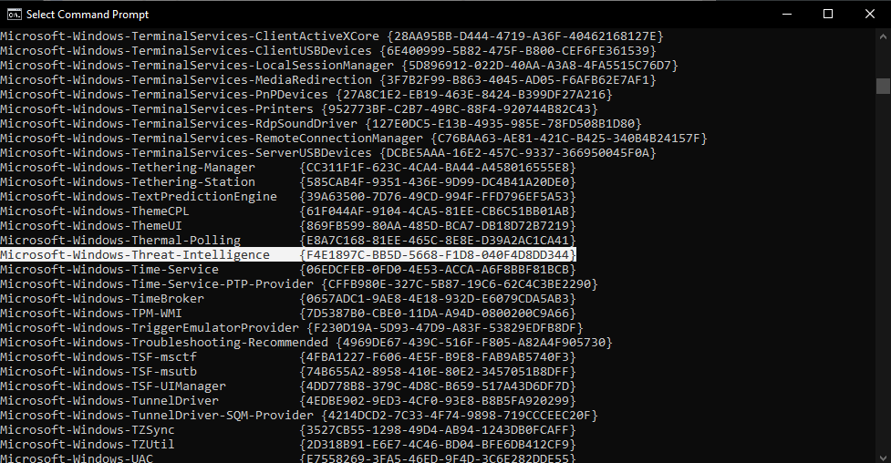
<sub>`logman` showing Microsoft-Windows-Threat-Intelligence provider</sub>

I'm making the assumption that, in theory, defensive tools subscribed to the event notifications might identify every usermode API generated from the cross-references of the `EtwThreatIntProvRegHandle` handle in real time.

## Events Descriptors
Each sort of event "capability" has a specific set of descriptors. If we quickly scan the code in `EtwTiLogReadWriteVm` following the call to [`EtwProviderEnabled`](https://docs.microsoft.com/en-us/windows-hardware/drivers/ddi/wdm/nf-wdm-etwproviderenabled), we can find references to symbols like `THREATINT_WRITEVM_REMOTE`:
### 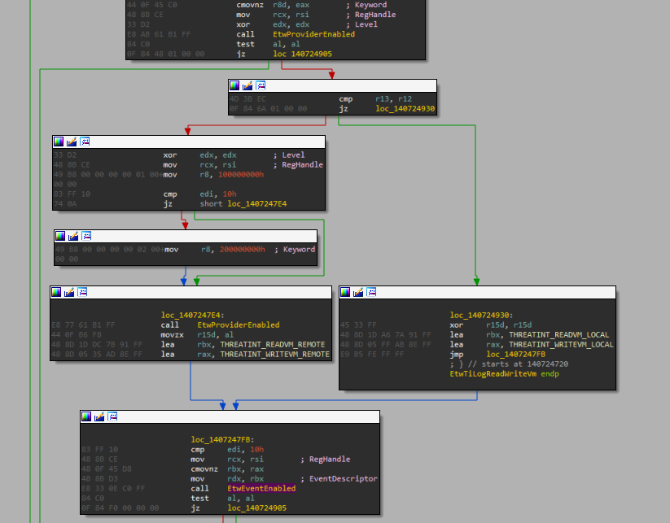
<sub>Call to [`EtwEventEnabled`](https://docs.microsoft.com/en-us/windows-hardware/drivers/ddi/wdm/nf-wdm-etweventenabled) with different event descriptors</sub>

The [`EtwEventEnabled`](https://docs.microsoft.com/en-us/windows-hardware/drivers/ddi/wdm/nf-wdm-etweventenabled) function establishes whether a certain event is permitted for logging on the connected provider handle. A quick examination of the function using the static `EtwThreatIntProvRegHandle` reveals that one of the major determinants of whether an event descriptor is recorded depends on the bitmask of the handle and the value of the event descriptor's `_EVENT_DESCRIPTOR.Keyword` field. The event will be reported if the sum of these two values tested is not zero.
### 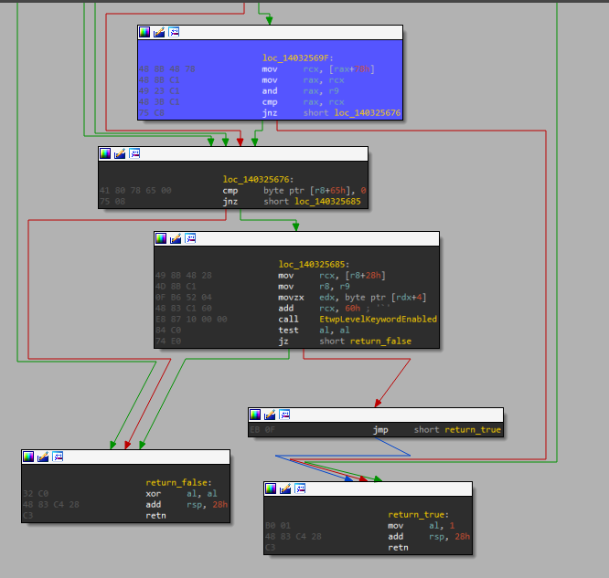
Throughout reboots, the handle's value is always `0x0000000'1c085445`, and the event descriptor's `Keyword` as described in the Threat Intelligence array above. If I understand correctly, we can determine which events are logged and which aren't if we `&` the handle's value and each event descriptor's bitmask values:
```
THREATINT_MAPVIEW_LOCAL_KERNEL_CALLER: false
THREATINT_PROTECTVM_LOCAL_KERNEL_CALLER: false
THREATINT_ALLOCVM_LOCAL_KERNEL_CALLER: false
THREATINT_SETTHREADCONTEXT_REMOTE_KERNEL_CALLER: false
THREATINT_QUEUEUSERAPC_REMOTE_KERNEL_CALLER: false
THREATINT_MAPVIEW_REMOTE_KERNEL_CALLER: false
THREATINT_PROTECTVM_REMOTE_KERNEL_CALLER: false
THREATINT_ALLOCVM_REMOTE_KERNEL_CALLER: false
THREATINT_THAW_PROCESS: false
THREATINT_FREEZE_PROCESS: false
THREATINT_RESUME_PROCESS: false
THREATINT_SUSPEND_PROCESS: false
THREATINT_RESUME_THREAD: false
THREATINT_SUSPEND_THREAD: false
THREATINT_WRITEVM_REMOTE: true
THREATINT_READVM_REMOTE: false
THREATINT_WRITEVM_LOCAL: false
THREATINT_READVM_LOCAL: false
THREATINT_MAPVIEW_LOCAL: false
THREATINT_PROTECTVM_LOCAL: false
THREATINT_ALLOCVM_LOCAL: true
THREATINT_SETTHREADCONTEXT_REMOTE: true
THREATINT_QUEUEUSERAPC_REMOTE: true
THREATINT_MAPVIEW_REMOTE: true
THREATINT_PROTECTVM_REMOTE: true
THREATINT_ALLOCVM_REMOTE: true
```
<sub>Threat intelligence event descriptors' logging status</sub>

## Writing Event Data

Let's examine the situation of writes instead, as this system does not get event data on any virtual memory reads. The data will be written using [`EtwWrite`](https://docs.microsoft.com/en-us/windows-hardware/drivers/ddi/wdm/nf-wdm-etwwrite) if the [`EtwEventEnabled`](https://docs.microsoft.com/en-us/windows-hardware/drivers/ddi/wdm/nf-wdm-etweventenabled) method returns `TRUE`:
### 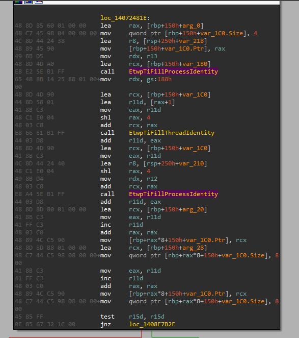
<sub>[`EtwWrite`](https://docs.microsoft.com/en-us/windows-hardware/drivers/ddi/wdm/nf-wdm-etwwrite) setup and call</sub>

The data, `UserData`, is supplied in the fifth parameter after the function declaration, and the number of entries is passed in the fourth:
```
NTSTATUS EtwWrite(
  REGHANDLE              RegHandle,
  PCEVENT_DESCRIPTOR     EventDescriptor,
  LPCGUID                ActivityId,
  ULONG                  UserDataCount,
  PEVENT_DATA_DESCRIPTOR UserData
);
```
<sub>[`EtwWrite`](https://docs.microsoft.com/en-us/windows-hardware/drivers/ddi/wdm/nf-wdm-etwwrite) function definition</sub>

As shown on a breakpoint in [`NtWriteVirtualMemory`](https://undocumented.ntinternals.net/index.html?page=UserMode%2FUndocumented%20Functions%2FMemory%20Management%2FVirtual%20Memory%2FNtWriteVirtualMemory.html), the method received the following arguments:
```
rcx=0000000000000e7c (ProcessHandle)
rdx=0000020051af0000 (BaseAddress)
r8=000000cf8697e168  (Buffer)
r9=000000000000018c  (NumberOfBytesToWrite)
```
<sub>First four arguments to [`NtWriteVirtualMemory`](https://undocumented.ntinternals.net/index.html?page=UserMode%2FUndocumented%20Functions%2FMemory%20Management%2FVirtual%20Memory%2FNtWriteVirtualMemory.html)</sub>

The `UserData` may be viewed as follows at a breakpoint before invoking [`EtwWrite`](https://docs.microsoft.com/en-us/windows-hardware/drivers/ddi/wdm/nf-wdm-etwwrite) in `EtwTiLogReadWriteVm`:
```
r: kd> dq @rax L@r9*2
ffffd286`70970880  ffffd286`709709d0 00000000`00000004
ffffd286`70970890  ffffd601`2e59b468 00000000`00000004
ffffd286`709708a0  ffffd601`2e59b490 00000000`00000008
ffffd286`709708b0  ffffd286`70970870 00000000`00000008
ffffd286`709708c0  ffffd601`2e59b878 00000000`00000001
ffffd286`709708d0  ffffd601`2e59b879 00000000`00000001
ffffd286`709708e0  ffffd601`2e59b87a 00000000`00000001
ffffd286`709708f0  ffffd601`2cdb16d0 00000000`00000004
ffffd286`70970900  ffffd601`2cdb1680 00000000`00000008
ffffd286`70970910  ffffd601`2e991368 00000000`00000004
ffffd286`70970920  ffffd601`2e991390 00000000`00000008
ffffd286`70970930  ffffd286`70970878 00000000`00000008
ffffd286`70970940  ffffd601`2e991778 00000000`00000001
ffffd286`70970950  ffffd601`2e991779 00000000`00000001
ffffd286`70970960  ffffd601`2e99177a 00000000`00000001
ffffd286`70970970  ffffd286`709709f0 00000000`00000008
ffffd286`70970980  ffffd286`709709f8 00000000`00000008
```
<sub>Dumping [`EtwWrite`](https://docs.microsoft.com/en-us/windows-hardware/drivers/ddi/wdm/nf-wdm-etwwrite) __[`EVENT_DATA_DESCRIPTOR`](https://docs.microsoft.com/en-us/windows/win32/api/evntprov/ns-evntprov-event_data_descriptor)__ entries

Each entry is an __[`EVENT_DATA_DESCRIPTOR`](https://docs.microsoft.com/en-us/windows/win32/api/evntprov/ns-evntprov-event_data_descriptor)__ structure defined as such:
```
typedef struct _EVENT_DATA_DESCRIPTOR {
  ULONGLONG Ptr;
  ULONG     Size;
  union {
    ULONG Reserved;
    struct {
      UCHAR  Type;
      UCHAR  Reserved1;
      USHORT Reserved2;
    } DUMMYSTRUCTNAME;
  } DUMMYUNIONNAME;
} EVENT_DATA_DESCRIPTOR, *PEVENT_DATA_DESCRIPTOR;
```
<sub>__[`EVENT_DATA_DESCRIPTOR`](https://docs.microsoft.com/en-us/windows/win32/api/evntprov/ns-evntprov-event_data_descriptor)__ structure</sub>

The `Size` field specifies the `Ptr` data's size in bytes while the `Ptr` points to the data.  But what information is being logged? If we take a closer look at some of these numbers, we can see that the base address and the amount of bytes written are represented by the last two variables:
```
r: kd> dq poi(@rax+f0) L1
ffffd286`709709f0  00000200`51af0000
r: kd> dq poi(@rax+100) L1
ffffd286`709709f8  00000000`0000018c
```
<sub>Base address and number of bytes written in [`EtwWrite`](https://docs.microsoft.com/en-us/windows-hardware/drivers/ddi/wdm/nf-wdm-etwwrite) data</sub>

## Protection Mask

Another criterion, in addition to being a local or remote action, may be shown if we reverse engineer another feature, [`NtAllocateVirtualMemory`](https://undocumented.ntinternals.net/index.html?page=UserMode%2FUndocumented%20Functions%2FMemory%20Management%2FVirtual%20Memory%2FNtAllocateVirtualMemory.html). The required protection type is identified by the call to `MiMakeProtectionMask`:
### 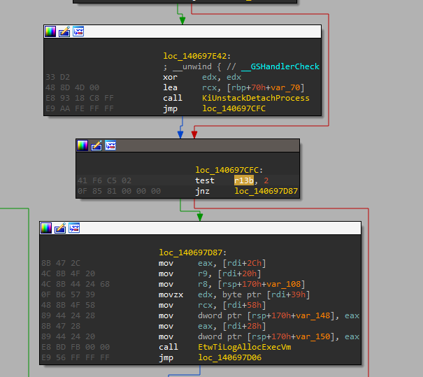
<sub>`MiMakeProtectionMask` operates on the requested protection value</sub>

The return value of `MiMakeProtectionMask` is set to the `r13d` register which is later referenced when deciding if code should branch to `EtwTiLogAllocExecVm`:
### 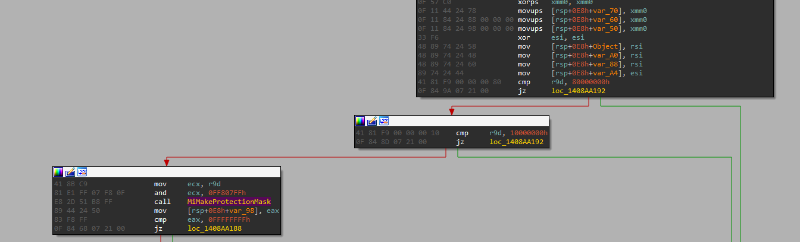
<sub>`MiMakeProtectionMask` return value determines if the call should be logged</sub>

What's intriguing is that, if the requested protection includes execution permissions, `MiMakeProtectionMask` will return a value that will log the call. According to the `EtwTiLogAllocExecVm`, I suppose it is safe to presume that this is the only goal. 
This also happens while calling [`NtProtectVirtualMemory`](https://undocumented-ntinternals.github.io/index.html?page=UserMode%2FUndocumented%20Functions%2FMemory%20Management%2FVirtual%20Memory%2FNtProtectVirtualMemory.html). It calls `MiMakeProtectionMask` first and provides the necessary protection. The purpose of this is to determine whether the protection type is legitimate, but it may also return a result that resembles [`NtAllocateVirtualMemory`](https://undocumented-ntinternals.github.io/index.html?page=UserMode%2FUndocumented%20Functions%2FMemory%20Management%2FVirtual%20Memory%2FNtProtectVirtualMemory.html)'s. To verify the status of the present protection, make the second call to `MiMakeProtectionMask`. The value obtained from the new protection is added to the return value of this. Therefore, the operation will be reported if either the new or the existing protection has execute rights.

## Conclusion

In combination with other kernel callbacks, the Threat Intelligence ETW offers an intriguing perspective on how Microsoft may enhance detection of harmful attacks. Note a few things: This method is retroactive since it is event-based, therefore certain data, such the data being written in [`NtWriteVirtualMemory`](https://undocumented.ntinternals.net/index.html?page=UserMode%2FUndocumented%20Functions%2FMemory%20Management%2FVirtual%20Memory%2FNtWriteVirtualMemory.html), is not recorded. Even so, my assumption is that the data could already be at the specified destination location, thus it might not matter.

Bypassing defensive technologies that use Threat Intelligence ETW may be more reliable after analysis of which operations may and may not be documented. It is likely to allocate `RW` harmful code before reprotecting it with execute rights, for instance, because local allocation without execute permissions will not be detected and local protection reporting is deactivated. Theoretically, this would avoid any Threat Intelligence ETW catches.

Despite the introduction of this technology, the possibility of false positives always exists. I've come across a lot of remote virtual memory writes throughout the debugging process, merely from the operating system. .NET processes are also known to employ `RWX` page permissions for JIT, which may be exploited for the local injection of malicious code.

## License

This project is licensed under the GNU General Public License v3.0 (GPLv3). For more details, please see the LICENSE file.

## Donation Options

If you find this article useful and would like to support me, you can make a donation via the following methods:
- **Bitcoin:** 3BRfR5wTG8br6WHHg8t4VR7z43Ej8mTUV5
- **Ethereum:** 0xc9a6e7175c55649dcc8ba0821cc2228193873755
- **Litecoin:** LXFmz25B36d3XcergMd4ttCjXPX9FnYTn6
- **USDT (TRC20):** TExNFUbP8W6eCZqB31AKLSVQFCqDLjYmr9
